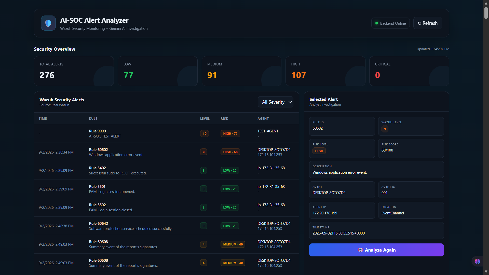
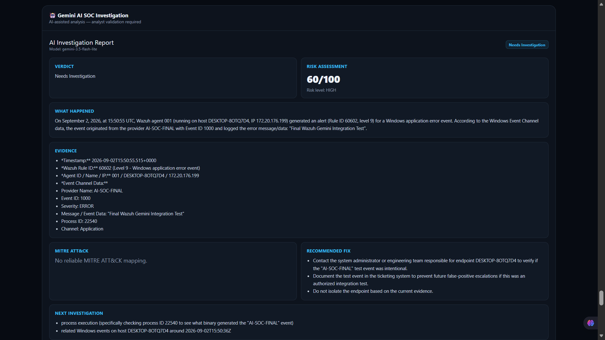

# 🤖 AI-SOC Alert Analyzer

### Wazuh Security Monitoring + Gemini AI Investigation

An AI-powered **Security Operations Center (SOC) alert analysis platform** that combines **Wazuh**, **FastAPI**, and **Google Gemini AI** to monitor security alerts, investigate suspicious events, assess risk, and assist SOC analysts with security investigations.

---

## 📌 Overview

**AI-SOC Alert Analyzer** is a practical cybersecurity project that demonstrates how **SIEM alert monitoring and Generative AI** can work together in a SOC environment.

The system collects security events from a monitored Windows endpoint using **Wazuh**, forwards alerts to a **FastAPI backend**, and allows analysts to send selected alerts to **Google Gemini AI** for investigation.

The dashboard provides security alert visibility, severity statistics, detailed alert information, risk assessment, evidence analysis, and AI-generated investigation recommendations.

> **Note:** Gemini AI is used as an analyst-assistance tool. Final security decisions should always be validated by a human analyst.

---

# 🏗️ Architecture

```text
┌─────────────────────────┐
│    Windows Endpoint     │
│     Security Events     │
└────────────┬────────────┘
             │
             ▼
┌─────────────────────────┐
│       Wazuh Agent       │
│   Endpoint Monitoring   │
└────────────┬────────────┘
             │
             ▼
┌─────────────────────────┐
│      Wazuh Manager      │
│   Rules + Decoders      │
│    Alert Generation     │
└────────────┬────────────┘
             │
             ▼
┌─────────────────────────┐
│   Custom AI-SOC         │
│      Integration        │
└────────────┬────────────┘
             │
             ▼
┌─────────────────────────┐
│    Cloudflare Tunnel    │
│     HTTPS Webhook       │
└────────────┬────────────┘
             │
             ▼
┌─────────────────────────┐
│     FastAPI Backend     │
│      API + Webhook      │
└────────────┬────────────┘
             │
             ▼
┌─────────────────────────┐
│     Google Gemini AI    │
│   Alert Investigation   │
└────────────┬────────────┘
             │
             ▼
┌─────────────────────────┐
│      SOC Dashboard      │
│ Risk + Evidence + AI    │
│     Investigation       │
└─────────────────────────┘
```

---

# 🔄 End-to-End Workflow

```text
1. Security event occurs on Windows endpoint
                    ↓
2. Wazuh Agent collects the event
                    ↓
3. Wazuh Manager processes the event
                    ↓
4. Wazuh rule generates an alert
                    ↓
5. Custom AI-SOC integration forwards the alert
                    ↓
6. FastAPI webhook receives the Wazuh alert
                    ↓
7. Alert is stored by the backend
                    ↓
8. SOC analyst selects an alert
                    ↓
9. Gemini AI analyzes the selected alert
                    ↓
10. Risk and investigation results are generated
                    ↓
11. Analyst validates the findings
```

---

# ✨ Key Features

## 🛡️ Wazuh Security Monitoring

* Real Wazuh alert ingestion
* Windows endpoint monitoring
* Wazuh rules and decoders
* Windows Event Channel monitoring
* Security event collection
* Alert severity classification
* Agent and host information
* Detailed security event data

## 🤖 Gemini AI Investigation

Gemini AI assists the analyst by providing:

* Alert summary
* Security verdict
* Risk score
* Risk level
* Suspicious activity explanation
* Evidence analysis
* MITRE ATT&CK mapping when reliable
* Recommended fixes
* Next investigation steps
* Final investigation assessment

## 📊 SOC Dashboard

The dashboard provides:

* Backend status
* Total alert count
* Low severity alerts
* Medium severity alerts
* High severity alerts
* Critical alerts
* Alert listing
* Rule information
* Agent information
* Host information
* Alert details
* Gemini AI investigation results

---

# 🧪 Real Wazuh + Gemini Test

The project was tested using a real Windows event generated on the monitored endpoint and successfully detected by Wazuh.

### Wazuh Detection

```text
Rule ID:       60602
Rule Level:    9
Event ID:      1000
Channel:       Application
Severity:      ERROR
```

The alert travelled through the complete pipeline:

```text
Windows Endpoint
       ↓
Wazuh Agent
       ↓
Wazuh Manager
       ↓
Rule 60602
       ↓
Custom AI-SOC Integration
       ↓
FastAPI Webhook
       ↓
SOC Dashboard
       ↓
Gemini AI Investigation
```

### Example Gemini Investigation

```text
Verdict:     Needs Investigation
Risk Score:  60/100
Risk Level:  HIGH
```

The AI analysis indicated that the event required analyst validation while recognizing that the available evidence could be consistent with an authorized test event.

The recommended investigation included validating the event and checking related process activity before taking containment actions.

---

# 🖥️ Dashboard Screenshots

## SOC Dashboard



## Gemini AI Investigation



---

# 🧰 Technology Stack

| Technology                  | Purpose                                 |
| --------------------------- | --------------------------------------- |
| **Wazuh**                   | Security monitoring and alert detection |
| **Wazuh Agent**             | Endpoint telemetry collection           |
| **Wazuh Manager**           | Alert processing and detection          |
| **FastAPI**                 | Backend API and webhook                 |
| **Python**                  | Backend and integration development     |
| **Google Gemini AI**        | AI-assisted alert investigation         |
| **Cloudflare Tunnel**       | HTTPS webhook connectivity              |
| **HTML / CSS / JavaScript** | SOC dashboard                           |
| **Windows 11**              | Monitored endpoint                      |
| **Ubuntu**                  | Wazuh server                            |
| **AWS EC2**                 | Wazuh server hosting                    |
| **Git / GitHub**            | Version control                         |

---

# 📁 Project Structure

```text
AI-SOC-Alert-Analyzer/
│
├── backend/
│   ├── main.py
│   └── backup files
│
├── data/
│   ├── sample_alerts.json
│   └── wazuh_alerts.jsonl
│
├── docs/
│   └── screenshots/
│       ├── dashboard.png
│       └── gemini-analysis.png
│
├── frontend/
│   ├── index.html
│   └── backup files
│
├── .gitignore
└── README.md
```

---

# ⚙️ Requirements

## Software

* Python 3.x
* FastAPI
* Uvicorn
* aiofiles
* Google GenAI SDK
* python-dotenv
* Wazuh Manager
* Wazuh Agent
* Cloudflare Tunnel

## Infrastructure

* Windows endpoint
* Ubuntu server
* AWS EC2 instance
* Wazuh Manager
* Internet connectivity for webhook communication

---

# 🚀 Installation

## 1. Clone the Repository

```bash
git clone https://github.com/hackthensh/AI-SOC-Alert-Analyzer.git
```

```bash
cd AI-SOC-Alert-Analyzer
```

---

## 2. Install Python Dependencies

Install the required packages:

```bash
pip install fastapi uvicorn aiofiles google-genai python-dotenv
```

---

# 🔐 Environment Variables

Create a local `.env` file in the project root:

```env
GEMINI_API_KEY=your_gemini_api_key
```

Never upload `.env` to GitHub.

The project uses `.gitignore` to protect environment files and Python cache files.

```text
.env
.venv/
__pycache__/
*.pyc
```

---

# ▶️ Run the FastAPI Backend

From the project root:

```powershell
python -m uvicorn backend.main:app --reload
```

The backend will normally be available at:

```text
http://127.0.0.1:8000
```

---

# 🌐 Cloudflare Tunnel

During development, Cloudflare Tunnel can expose the local FastAPI server through HTTPS.

Example:

```powershell
cloudflared tunnel --url http://127.0.0.1:8000
```

Cloudflare generates a temporary HTTPS URL.

The Wazuh integration can forward alerts to:

```text
https://YOUR-CLOUDFLARE-URL/api/wazuh-webhook
```

> Quick Tunnel URLs are temporary and should not be used as permanent production endpoints.

---

# 🔗 Wazuh Custom Integration

The project uses a custom Wazuh integration named:

```text
custom-ai-soc
```

The integration script is located on the Wazuh server at:

```text
/var/ossec/integrations/custom-ai-soc
```

Example Wazuh configuration:

```xml
<integration>
    <name>custom-ai-soc</name>
    <hook_url>https://YOUR-CLOUDFLARE-URL/api/wazuh-webhook</hook_url>
    <alert_format>json</alert_format>
</integration>
```

After configuring the integration:

```bash
sudo systemctl restart wazuh-manager
```

---

# 🔌 API Endpoints

## Health Check

```text
GET /health
```

Checks whether the FastAPI backend is running.

## Wazuh Webhook

```text
POST /api/wazuh-webhook
```

Receives Wazuh JSON alerts.

## Wazuh Alerts

```text
GET /api/wazuh-alerts
```

Returns collected Wazuh alerts.

## Wazuh Summary

```text
GET /api/wazuh-summary
```

Returns alert statistics and severity information.

---

# 🧠 AI Investigation Flow

When an analyst selects an alert:

```text
Wazuh Alert
     ↓
Alert Evidence Extraction
     ↓
Gemini AI
     ↓
Security Analysis
     ↓
Risk Assessment
     ↓
MITRE ATT&CK Mapping
     ↓
Recommended Fix
     ↓
Next Investigation
     ↓
SOC Analyst Validation
```

The AI assists the analyst but does not automatically make final incident-response decisions.

---

# 🔎 Security Investigation

Important evidence available from Wazuh alerts can include:

* Timestamp
* Agent ID
* Hostname
* IP address
* Rule ID
* Rule level
* Event ID
* Provider
* Event channel
* Process information
* Windows event information
* Alert severity

This information helps the SOC analyst understand the context of the event and determine the appropriate investigation path.

---

# 🧑‍💻 SOC Use Cases

### 1. Security Alert Monitoring

Monitor endpoint security events using Wazuh.

### 2. Alert Triage

Prioritize alerts based on severity and investigation context.

### 3. AI-Assisted Investigation

Use Gemini AI to analyze selected security alerts.

### 4. Evidence Analysis

Review important security-event fields and supporting evidence.

### 5. MITRE ATT&CK Mapping

Identify relevant ATT&CK techniques when sufficient evidence is available.

### 6. Incident Investigation

Use AI-generated recommendations to guide further investigation.

### 7. Analyst Validation

Human analysts validate AI findings before performing containment or remediation.

---

# 🔒 Security Considerations

## Credential Security

Never commit sensitive information such as:

```text
.env
API keys
Passwords
Wazuh credentials
Access tokens
Cloud credentials
Private keys
```

## AI Security

Gemini AI output should be treated as **analyst assistance**, not absolute truth.

Before responding to a security incident, analysts should validate:

* Original Wazuh alert
* Endpoint activity
* Process execution
* Related events
* Network activity
* User activity
* Threat intelligence

---

# ☁️ Deployment Architecture

A practical deployment can use AWS EC2 for the Wazuh server.

```text
                 AWS EC2
                    │
                    ▼
             Wazuh Manager
                    │
                    ▼
              Wazuh Alerts
                    │
                    ▼
           Custom Integration
                    │
                    ▼
          Cloudflare Tunnel
                    │
                    ▼
            FastAPI Backend
                    │
                    ▼
              Gemini AI
                    │
                    ▼
             SOC Dashboard
```

For development, Cloudflare Tunnel provides HTTPS connectivity between the Wazuh server and the locally running FastAPI application.

---

# 🔮 Future Improvements

Possible future enhancements:

* SOAR integration
* Automated alert enrichment
* Threat intelligence integration
* IOC extraction
* VirusTotal integration
* MITRE ATT&CK visualization
* Alert correlation
* User authentication
* Role-based access control
* PostgreSQL database
* Docker deployment
* AWS-native deployment
* Automated incident reports
* PDF investigation reports
* Email / Slack notifications
* Advanced detection engineering
* AI-assisted incident response

---

# 🎯 Skills Demonstrated

This project demonstrates practical experience with:

* SOC Operations
* SIEM
* Wazuh
* Security Monitoring
* Alert Triage
* Incident Investigation
* Windows Event Analysis
* Linux Administration
* Python
* FastAPI
* REST APIs
* Webhooks
* Google Gemini AI
* Cloudflare Tunnel
* AWS EC2
* MITRE ATT&CK
* Git
* GitHub
* Security Automation
* AI-assisted Cybersecurity

---

# 🏆 Project Outcome

The project demonstrates a complete SOC monitoring and AI-assisted investigation workflow:

```text
Detect
  ↓
Collect
  ↓
Analyze
  ↓
Investigate
  ↓
Assess Risk
  ↓
Validate
  ↓
Respond
```

The complete technical pipeline is:

```text
Windows Endpoint
       ↓
Wazuh Agent
       ↓
Wazuh Manager
       ↓
Custom Integration
       ↓
FastAPI Webhook
       ↓
Gemini AI
       ↓
Risk Assessment
       ↓
SOC Analyst Dashboard
```

This project demonstrates how Generative AI can assist SOC analysts with **alert triage, investigation, evidence analysis, risk assessment, and prioritization** while keeping the human analyst responsible for final security decisions.

---

# ⚠️ Disclaimer

This project is intended for:

* Educational purposes
* Cybersecurity learning
* SOC analyst practice
* Security monitoring demonstrations
* Authorized lab environments

Do not use this project to monitor systems or networks without proper authorization.

---

# ⭐ Support

If you find this project useful, consider giving the repository a ⭐ on GitHub.

---

## 🔐 AI-SOC Alert Analyzer

**Wazuh Security Monitoring + Gemini AI Investigation**

**Detect → Analyze → Investigate → Validate → Respond**

---

## 🔗 GitHub Repository

[AI-SOC-Alert-Analyzer](https://github.com/hackthensh/AI-SOC-Alert-Analyzer)
